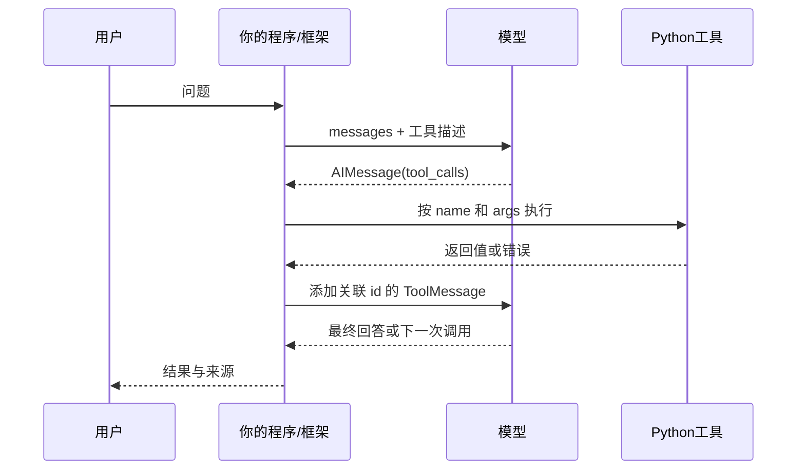

# Python、框架与协议接口手册

每天只查任务卡出现的项。下面区分语言写法、库接口、消息协议；本机版本见 [调研记录](curriculum/RESEARCH.md)。完整参数以官方文档与锁定环境为准。

## 先看一次数据流

每个箭头都问三件事：值是什么类型、谁负责动作、失败交给谁。模型的工具调用描述不等于工具已执行。

## Python 写法（w04～w05）

| 写法 | 输入 → 输出 | 核心含义与常见错 |
|---|---|---|
| `records[0]` | 列表 → 第一项 | 空列表不能取第零项 |
| `record["path"]` | 字典 → path 对应值 | 没有这个键会 KeyError，不会自动生成 |
| `for record in records:` | 一批 → 每次一项 | 循环变量不是整个容器 |
| `value in values` | 元素+集合 → bool | 字符串 in 检查子串；字典 in 默认查键 |
| `items.append(value)` | 列表被追加，调用返回 None | 不要把 append 的返回值当新列表 |
| `return value` | 当前函数 → 调用处 | 同时结束本次函数执行 |
| `word.strip().lower()` | str → 新 str | 原字符串不会被修改 |
| `Path(root) / name` | 路径对象+名字 → 路径 | 拼接路径还没读文件；绝对名字与 .. 需要范围检查 |
| `path.read_text(encoding="utf-8")` | 文件 → str | 文件不存在/编码错误须处理 |
| `json.dumps(obj)` / `json.loads(text)` | 对象 ↔ JSON 字符串 | loads 解析文本，load 读文件对象 |
| `await call()` | 协程调用 → 执行结果 | 不加 await 往往只得到协程对象 |
| `asyncio.timeout(seconds)` | 异步作用域 → 到时取消 | 单次超时和整轮上限分别约束不同边界 |

[Python 官方教程](https://docs.python.org/3/tutorial/controlflow.html)。文件与异步接口在本周热身中已按运行环境验证。

## LangChain（w04～w05）

| 接口 | 在本课程里传什么、得到什么 | 为什么用 / 注意什么 |
|---|---|---|
| `@tool` | 有类型注解和说明的函数 → 工具对象 | 参数说明给模型看，业务逻辑仍是你的函数 |
| `get_input_schema().model_json_schema()` | 工具 → schema 字典 | 观察模型会看到哪些参数，不能由此推断执行已成功 |
| `tool.ainvoke({"keyword": "retry"})` | 参数字典 → 工具返回值 | 这是代码指定调用，尚未证明模型自主选择 |
| `tool.ainvoke(tool_call)` | 含 name/args/id/type 的完整调用 → ToolMessage | 框架保留关联编号，结果可放进历史 |
| `model.bind_tools(tools)` | 工具对象列表 → 已绑定模型接口 | 绑定只告知能力，模型不直接运行函数 |
| `model.ainvoke(messages)` | 消息历史 → AIMessage | 正文可为空，工具调用在 tool_calls |
| `create_agent(model=..., tools=...)` | 模型+工具 → agent | 代劳常见循环，但输入校验、业务与权限仍需设计 |
| `ModelCallLimitMiddleware(run_limit=4)` | 每轮限制策略 | 配合整轮 timeout，避免无限调用 |

消息至少区分 HumanMessage、AIMessage、ToolMessage。tool_call 的 args 已是参数字典；如果从原始 HTTP 返回的 arguments 读到字符串才需要 JSON 解析。[LangChain Tools](https://docs.langchain.com/oss/python/langchain/tools)。

## LangGraph（w06）

| 接口 | 输入 → 输出 | 需要理解的事 |
|---|---|---|
| `StateGraph(State)` | 状态形状 → 图构建器 | TypedDict 描述形状，运行时仍是字典 |
| `add_node("name", fn)` | 节点名+函数 | 传 fn，不写 fn() 提前执行 |
| `add_edge(a, b)` | 固定起点与终点 | 图不比普通循环更“神奇”，它显式表示控制流 |
| `add_conditional_edges(a, route, mapping)` | 路由函数返回键 → 选择终点 | route 返回的是分支名，不是最终回答 |
| `compile(checkpointer=...)` | 构建器 → 可执行图 | 同时接入检查点等运行能力 |
| `ainvoke(state, config)` | 初始/恢复输入 → 运行结果 | 会话身份在 config 中，不是工具调用编号 |
| `astream(..., stream_mode="updates")` | 状态输入 → 逐次节点更新 | 用 async for 消费事件 |
| `InMemorySaver()` | 内存检查点 | 进程结束即消失，w09 才验证跨进程持久化 |
| `interrupt(payload)` | 暂停请求 → 恢复时传入的值 | 节点可能重入，不应在暂停前执行不幂等副作用 |
| `Command(resume=value)` | 人的恢复输入 | 配合原检查点和同一 thread_id 继续 |

[Graph API](https://docs.langchain.com/oss/python/langgraph/graph-api)、[Interrupts](https://docs.langchain.com/oss/python/langgraph/interrupts)。

## 数据结构与真实性（w07）

`BaseModel` 定义字段；`Answer.model_validate(raw)` 校验数据并返回对象；`ValidationError` 告诉你哪个字段不符合约定。`strict=True` 减少隐式类型转换，`extra="forbid"` 拒绝多余字段。

这是本地校验。LangChain 的 `response_format` 是模型最终结构化回答接口，策略依模型能力而异；本课程 D18 不宣称已验证某个厂商的真实 schema 生成。字段正确后还要核对引用来源。[Structured output](https://docs.langchain.com/oss/python/langchain/structured-output)。

## 协议、范式与运行层（后续）

MCP 的最小体验是初始化会话 → tools/list 发现描述 → tools/call 发 name/arguments → 收到结果并验证实际文件。SDK 处理传输与协议细节，业务函数仍来自已有项目。具体 SDK 版本与能力在 w10 开周核对。[MCP 架构](https://modelcontextprotocol.io/docs/learn/architecture)。

Skills 描述“何时用、怎样完成任务、读哪些参考”，不等同于 Python 函数。RAG 管证据取得，memory 管跨时保存，planner 管任务分解，supervisor/handoff 管控制权；harness 把这些能力与权限、预算、恢复和验证组织在一起。

FastAPI/HTTP、SSE、持久化驱动和容器接口在对应周逐项加入，按照任务卡给最小运行例子；不在初学阶段要求同时记住所有接口。所有后续 API 变更必须先核查官方资料，再更新手册与测试。
