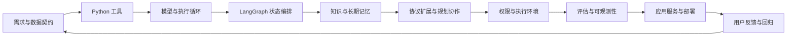

# Python + Agent 完整学习路线

## 时间与目标

你的起点：前三周已学完、能理解核心思想，Python 独立写作仍需反复练。目标有两条：Pi 类 coding agent，以及 LangChain / LangGraph 驱动的 DeerFlow 类应用。

**完整闭环优先。** 课程从 w04 起安排 12 个学习周、60 次任务，每次最多 60 分钟，约 60 小时。按每周五次约三个月；一个月是第一版应用的交付节点。这个估算不保证完全掌握所有前沿技术，独立验收未过就顺延。

不用另开一条脱离项目的 Python 课。同一个“代码仓库助手”逐步增加工具、循环、图、知识、记忆、协作、权限、评估和服务能力。所有每日任务见 [课程目录](curriculum/README.md)，当前实际进度见 [状态](COURSE_STATE.json)。

## 完整能力链

| 阶段 | 任务 | 要形成的能力 | 验收产物 |
|---|---|---|---|
| 首月基础闭环 | D01～D20 / w04～w07 | Python 数据处理、工具、有限 agent 循环、LangChain、LangGraph、证据与评估 | 可运行的仓库助手；测试、本人重写与一份真实执行记录 |
| 知识与长任务 | D21～D30 / w08～w09 | RAG、来源、短/长期记忆、跨进程恢复、幂等 | 文档检索与可恢复任务，不重复副作用 |
| 前沿扩展 | D31～D40 / w10～w11 | MCP、Skills、计划、supervisor/handoff、并行协作 | 跨客户端同一工具；单/多 agent 对照评估 |
| 可控可靠 | D41～D50 / w12～w13 | 上下文预算、按需加载、权限、沙箱、系统评估、trace | 能解释失败、控制执行、复测质量的 harness |
| 交付闭环 | D51～D60 / w14～w15 | API、流式界面、并发隔离、部署、恢复、回归 | 可被其他人使用和接手的完整应用 |

## 怎么推进

每天只打开一张任务卡；5 分钟回忆、10 分钟热身、30 分钟本人操作、10 分钟验证、5 分钟交接。每第五次课复盘并隔天迁移。周末可以休息或补同一任务；进度落后不把几课叠到一天。

知识深度分成“能解释、能改、能独立写、能交付”。前沿主题都会出现并有动手/对照/验收，不能因为一个月短就从完整路线删除；也不以读过一篇文章登记为独立掌握。

前三周历史保持冻结；不要求凭旧测试重走全部课程。D01 诊断与每周重写用来找真正需要补的写法。跨周复用通过调用已有函数，新增框架必须能说明它接手了什么。

## 毕业的定义

本人能从需求设计一个小 agent 应用，写出新工具和图节点，解释消息/状态/协议，定位一次工具失败，验证来源与结果，恢复中断任务，在独立环境启动并让他人按文档使用。剩余薄弱项明确列出，不能用“全会了”掩盖未知。
