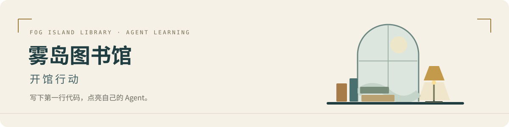

<p align="center">
  
</p>

<p align="center">
  <strong>一边学 Python，一边亲手构建能运行、能验证、能交付的 Agent。</strong>
</p>

<p align="center">
  <a href="curriculum/README.md">完整课程</a> ·
  <a href="curriculum/tasks/D01.md">从 D01 开始</a> ·
  <a href="GLOSSARY.md">术语词典</a> ·
  <a href="API_GUIDE.md">API 手册</a> ·
  <a href="HARNESS_GUIDE.md">换模型继续学</a>
</p>

---

## 为独立开发而练习

这是一个面向 Python 基础薄弱学习者的个人学习仓库。以“代码仓库助手”为主线，从列表、字典和函数返回值开始，逐步加入工具调用、LangChain、LangGraph、知识检索、记忆、协作与部署。

**12 个学习周 · 60 次任务 · 每天最多 1 小时。** 首月目标是交付第一版应用，完整路线继续覆盖后续能力。每一课都有具体动作、原因、核心思想与验收；进度以独立写作和实际结果为准。

> **学习边界**：AI 提供中文注释的示范、骨架和测试；TODO 与独立练习由学习者完成。每周通过测试、本人解释与隔天重写共同验收。

## 三步开始

需要 [uv](https://docs.astral.sh/uv/getting-started/installation/) 与 Git。项目要求 Python 3.11+，依赖由 `uv.lock` 锁定。

```sh
# 1. 获取课程与依赖
git clone https://github.com/wyzz973/agent-learning.git
cd agent-learning
uv sync

# 2. 查看当前任务
uv run python scripts/learn.py

# 3. 预测输出，再运行第一份热身
uv run python weeks/w04-python-tools/00_warmup.py
```

已有本地仓库时，从 `uv sync` 开始。离线热身与练习无需 API key。

<details>
<summary><strong>什么时候需要真实模型？</strong></summary>

完成对应前置练习后，可以显式选择 `--live`，体验真实模型调用。按照 [.env.example](.env.example) 在本地 `.env` 配置 `DEFAULT_MODEL` 和对应厂商密钥；保留已有配置，密钥不提交到 Git。

```sh
# 前置：完成 w04、w05 对应练习
uv run python scripts/run_course_app.py --mode langchain --live
```

真实调用按模型服务实际计费。默认回放模式使用固定回复，工具和学习者代码仍会执行；回放结果与真实模型能力分别记录。

</details>

## 同一个项目，逐步长出能力

| 学习阶段 | 任务 | 本阶段要交付什么 |
| :--- | :---: | :--- |
| **01 · Python 与 Agent 基础** | D01–D20 | 搜索工具 → 有限 agent 循环 → LangChain / LangGraph → 基础评估 |
| **02 · 知识与持续任务** | D21–D30 | 带来源的 RAG、长期记忆、跨进程恢复与幂等 |
| **03 · 协议与协作** | D31–D40 | MCP、Skills、任务规划、单 / 多 agent 对照 |
| **04 · 可控与可度量** | D41–D50 | 上下文预算、权限、沙箱、执行轨迹与回归评估 |
| **05 · 应用交付** | D51–D60 | API、流式界面、部署、回滚与综合项目验收 |

课程从仓库编号 **w04** 开始；w01–w03 保留为历史学习存档。每周详细安排见 [学习路线](LEARNING_PATH.md) 与 [60 张任务卡](curriculum/README.md)。

## 每天的一小时

| 回忆 | 热身 | 动手 | 验证 | 交接 |
| :---: | :---: | :---: | :---: | :---: |
| **5 min** | **10 min** | **30 min** | **10 min** | **5 min** |
| 说清上次输入与输出 | 预测、运行、解释 | 自己填空或独立写 | 测试、检查失败路径 | 记录证据与下一步 |

每天只打开当前任务。遇到卡点就续做同一课，周末可休息或补课；每第五次课做复盘与迁移检查。

## 按问题找到入口

| 我现在需要…… | 打开这里 |
| :--- | :--- |
| 知道今天具体做什么 | [当前学习状态](COURSE_STATE.json) · [课程入口](scripts/learn.py) |
| 看某周的目标和任务 | [完整课程目录](curriculum/README.md) |
| 弄懂一个名词或 Python 写法 | [术语词典](GLOSSARY.md) · [Python 能力线](PYTHON_TRACK.md) · [语法速查](SYNTAX_CARDS.md) |
| 弄懂 API、消息与数据流 | [API 手册](API_GUIDE.md) |
| 换 Claude Code、Codex 或其他模型 | [跨 harness 交接协议](HARNESS_GUIDE.md) |
| 查导师规则与模块职责 | [AGENTS.md](AGENTS.md) · [模块地图](MODULES.md) |
| 了解教学方法与资料来源 | [调研依据](curriculum/RESEARCH.md) · [资源入口](RESOURCES.md) |

## 换模型，接着同一课

根目录和各模块的 `CLAUDE.md` 链接同目录 `AGENTS.md`，共用一份规则。当前任务、本人证据、卡点与下一步统一保存在 `COURSE_STATE.json`。

```sh
# 生成交接提示，交给下一位模型导师
uv run python scripts/learn.py --handoff

# 只读预览其他任务，不推进学习状态
uv run python scripts/learn.py --task D20
```

其他模型仍需实际读取这些文件；它们不会自动共享聊天历史。完整流程见 [交接协议](HARNESS_GUIDE.md)。

## 仓库结构

```text
agent-learning/
├── curriculum/           # 完整路线、60 张任务卡与教学依据
├── weeks/                # 每周热身、示范、本人练习和测试
├── src/agentlab/          # 跨周复用与教师连接代码
├── scripts/              # 每日入口、交接与仓库检查
├── tests/                # 教师基础设施测试
├── notes/                # 逐字问答、本人复盘与决策记录
├── templates/            # 新任务与新周模板
├── COURSE_STATE.json     # 实际学习进度
└── AGENTS.md             # 共同教学与开发规则
```

## 检查与验收

```sh
# 进行中：检查格式、类型、教师设施、课程与规则
./check.sh --wip

# 周末验收：额外运行指定周的练习测试
./check.sh --week w04

# 只调试当前练习；每周使用独立测试进程
uv run pytest weeks/w04-python-tools -q
```

学习者尚未完成的 TODO 会明确报错。`--wip` 通过表示仓库与教材设施通过检查，不能据此宣布练习完成；不带参数的 `./check.sh` 会检查所有已创建周的练习。

| 材料 | 当前范围 |
| :--- | :--- |
| **w01–w03** | 历史学习代码，保持冻结 |
| **w04–w07** | 已备好可运行热身、示范、练习骨架与测试；答案由学习者完成 |
| **w08–w15** | 每日任务、产物与验收已排定；练习代码按 [开周流程](curriculum/TEACHING.md) 准备 |

实际学习进度以 [COURSE_STATE.json](COURSE_STATE.json) 为准。**能独立实现、解释、调试和验证，才算学到自己手里。**
