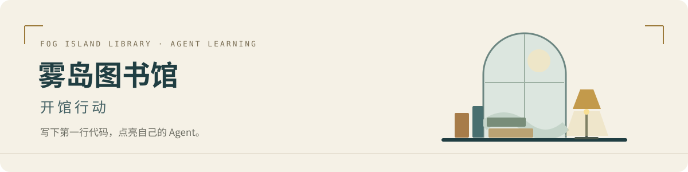
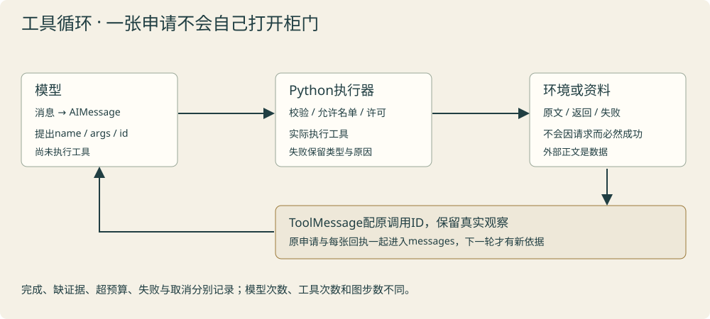

<div align="center">



# 雾岛图书馆 · 开馆行动

**从第一行 Python，到你亲手交付的 AI Agent。**

一座图书馆，一个持续生长的项目。用中文 Jupyter Notebook 学原理、写代码、做实验。

[](pyproject.toml) [](uv.lock) [](uv.lock) [](#全馆地图) [](https://github.com/wyzz973/agent-learning/actions/workflows/course-check.yml)

[快速开始](#快速开始) · [学习路线](#全馆地图) · [当前委托](#当前委托) · [验证记录](#验证与边界) · [参与贡献](CONTRIBUTING.md)

</div>

> 图书馆准备试营业。馆长林禾把一张公告放在电脑旁：<br>
> “门口有读者问周六几点开门。先让阿灯把这一件事做好。”

你是新人工程师，要为林禾建造助手 **阿灯**。从读懂一张公告开始，让它逐步学会查资料、调用工具、恢复中断、组织研究、提供服务，并在隔离环境修复代码。每项新能力都要进入后续作品，经受新输入和真实失败的检验。

**不预设 Python、框架或 Agent 经验。** 必要语法、原理、数据流、实际 prompt、教师示范、本人练习与检查都在当前 Notebook 原位提供。已有编程基础，可以略读熟悉的语法，保留机制实现和实验。

## 为什么这样学

| 课程设计 | 你会怎样学习 |
|---|---|
| **一个贯穿全程的项目** | 十章共同建造机构数字知识服务，先前的工具、记忆和检索继续进入研究与交付。 |
| **先看懂，再亲手做** | 观察完整示范的输入、中间值和输出，经过具体小步，逐渐独立组织关键函数。 |
| **把原理放进实验** | 改变一个条件，比较结果；检查错误回执、状态恢复、引用支持、检索指标与评估分歧。 |
| **用自己的 Agent 交互** | 章末接待台调用你明确传入的函数，展示实际依据、运行状态和作品，并支持取消。 |
| **用三种证据判断掌握** | 分别记录本人程序运行、原理选择题和陌生输入迁移；选择题提交后逐项解释。 |

**10 个模块 · 44 项委托 · 115 道判断题 · 44 张逐关数据流图。** 每章沿“从零入门 → 组件开发 → 生产情景实训”推进。一次学习约一小时，有休息点；复杂委托可以分多次完成。完整路线的核心学习时间估计约 **159 小时**，生产深入另留时间，按实际进度调整。

## 快速开始

### 1. 准备环境

需要 Git 和 [uv](https://docs.astral.sh/uv/getting-started/installation/)。以下命令使用锁定依赖；uv 会按需准备 Python 3.12。

```sh
git clone https://github.com/wyzz973/agent-learning.git
cd agent-learning
uv sync --locked --python 3.12
```

### 2. 配置模型

将 [`.env.example`](.env.example) 另存为根目录的 `.env`，填入自己的 `DEEPSEEK_API_KEY`。已有 `.env` 时沿用现有配置。示范默认使用模板指定的 DeepSeek 模型，真实调用按提供方计费；LangSmith 追踪为可选项。

```dotenv
DEEPSEEK_API_KEY=填入你的密钥
```

课程运行时从 `.env` 加载配置。Notebook 与运行记录只展示公开输入、结果和轨迹。

### 3. 打开学习工作台

```sh
uv run python -m instructor.launch
```

启动器注册 **Agent Learning (.venv)** 内核，并打开 JupyterLab 中的[当前委托](#当前委托)。按 **Shift + Enter** 逐格运行；标为“本人动手”的代码需要你实现，`NotImplementedError` 是明确的练习停点。

**首次学习从 [M01-T01 · 接待第一位读者](modules/01-langchain-foundations/01-first-reader.ipynb) 开始。** 启动后在 JupyterLab 左侧打开 `modules/01-langchain-foundations/01-first-reader.ipynb`，保留项目内核。仓库中的当前委托与已保存练习是作者的学习记录；克隆仓库不代表你已完成第一关。继续已有进度时，使用下方当前委托。

<details>
<summary>环境检查、RAG 模型与 Docker</summary>

```sh
uv run python -m instructor.doctor
```

检查 Python、配置文件和 Docker 状态。Docker 暂时未启动不影响前几章；M08 的模型生成代码只在受限 Docker 环境中运行。

进入 RAG 课前，按当前页说明准备本地 embedding 缓存：

```sh
uv run python -m instructor.doctor --prepare-embedding
```

首次需要下载模型。当前示范使用英文 BGE 小模型，并在双语实验中观察其适用范围；检索质量由实际测量判断。

也可在支持 Jupyter 的 IDE 中打开 Notebook，选择项目 `.venv` 内核。遇到环境或认证错误，报告公开错误类型与所在格子，隐去密钥。

</details>

## 当前委托

<!-- current-task:start -->
### [M01-T02 · 装好公告牌：把回答分进正确格子](modules/01-langchain-foundations/02-notice-board.ipynb)

> 馆长林禾：“把阿灯的答复分成答案、依据和仍需确认的事项，让公告牌能稳定读取。”

**你亲手完成：**本人定义最小答复契约，并把已完成的公告输入接到真实结构化模型调用；分别处理字段是否合法与结论是否受公告支持。

**本关作品：**notice-answer.json 与可在 Notebook 展示的公告答复卡；阿灯能把答案、公告编号和不足说明交给程序读取。
<!-- current-task:end -->

每次从当前格子继续。代码、本人尝试、真实结果和下一小步保存在工作区；教师示范运行通过与本人完成分别记录。

## 全馆地图

主线：**Python / LangChain → LangGraph → 记忆与 RAG → 研究与评估 → MCP / Skills → Coding Agent → 运行服务 → 整体交付**。

<!-- evolution-map:start -->
| 区域 | 你会接到什么委托 | 在这里学的核心技术 |
|---|---|---|
| [门厅 · 第一盏接待灯](modules/01-langchain-foundations/README.md) | 帮门口读者读懂开馆公告，让公告台显示答复。 | Python起步、消息、结构化输出 |
| [问询台 · 打开资料柜](modules/02-tools-and-agents/README.md) | 让阿灯自己申请公告和手册，处理取件失败。 | Tools、tool calling、执行器、错误反馈 |
| [委托台 · 把事情办完](modules/03-langgraph-control/README.md) | 连续查资料、分流问题，让读者看到进度并能取消。 | LangGraph状态、节点、反馈循环、事件 |
| [值班室 · 交班不失忆](modules/04-memory-and-human-review/README.md) | 断电后接续委托，记住确认信息，保留可核对的经验。 | 检查点、HITL、长期记忆、上下文、Reflexion |
| [研究阅览室 · 为数字馆查证](modules/05-deep-research/README.md) | 为阿灯的建设方案寻找真实技术依据，补足研究缺口。 | 搜索/fetch、RAG、证据、自适应研究 |
| [服务台 · 接受开馆验收](modules/06-research-system/README.md) | 研究者分工，定位失败，让另一台设备使用阿灯。 | 协作、评估、消融、tracing、服务交付 |
| [交换站 · 分享工具和方法](modules/07-protocols-and-skills/README.md) | 把资料工具与核查方法交给分馆，比较成熟装配方式。 | MCP、Skills、按需工具发现、DeepAgents |
| [维修间 · 阿灯维护自己](modules/08-coding-agent/README.md) | 修复数字馆的真实组件，中断后还能继续维修。 | coding agent、隔离执行、harness、源码迁移 |
| [运行室 · 接稳日常使用](modules/09-runtime-and-service/README.md) | 让阿灯的流式、预算、接口与服务身份有真实边界。 | streaming、缓存、重试、模型契约、认证授权 |
| [开馆验收桌 · 交出整座馆](modules/10-opening-capstone/README.md) | 把本人全部能力接成可复现、可回归、有实际凭据的数字馆。 | workflow选择、端到端、留出、独立扩展、发布清单 |

**44 项委托的完整 Notebook 已备好。**按当前委托逐关学习，每关可以分多次完成；教师示范运行通过不等于本人通关。
<!-- evolution-map:end -->

模块索引用于浏览路线，学习与交接仍从首页进入当前 Notebook。[完整学习路线](instructor/LEARNING_ROUTE.md)列出任务、时间估计与休息安排；[故事线](world/STORY.md)供选读。

## 最后能留下什么

| 实际需求 | 逐步做出的作品 | 要能说明的问题 |
|---|---|---|
| 读者询问馆务 | 有依据的答复、结构化公告卡与工具运行时 | 哪些事实来自本次输入？失败怎样反馈给模型？ |
| 委托中断后继续 | 状态图、检查点与作用域明确的记忆 | 恢复到哪里？哪些信息可以保留、更正或撤回？ |
| 馆长需要建设方案 | 检索与研究报告、原文证据、质量对照 | 检索漏了什么？引用是否支持结论？增加步骤有无收益？ |
| 分馆使用阿灯 | MCP 客户端、Skills 方法与服务入口 | 协议如何传递能力？身份、权限、预算和取消如何落实？ |
| 组件出现缺陷 | 隔离维修补丁、测试、回归与交接材料 | 测试对应哪个版本？失败能否复现？另一个人怎样接手？ |

毕业模块还要求完成陌生需求、选择最小架构、保留旧能力，并整理源码来源、当前版本、验收、演示与运行手册。这些产物可作为个人项目和求职时的技术说明材料；完整作品由学习者实际完成。

## 从请求到行动，亲眼看到机制



**Tools 执行动作，LangGraph 管理状态与控制，memory 保存并取回信息，MCP 连接能力，Skills 提供方法。** Notebook 会沿具体输入解释这些职责，再让你实现关键部分。

阿灯的岗位、委托、依据、可用能力和完成条件进入实际模型 prompt。你可以查看[第一关系统提示](world/prompts/M01-T01.md)；后续研究、协作和维修也服务于这座图书馆。研究真实技术资料时保留 URL、取得时间与原文支持。

## 验证与边界

教材与设施检查可以公开复核。以下教师执行快照记录于 **2026-10-04**，逐关范围、源码指纹和跳过清单见[验证记录](instructor/validation.json)。

| 检查 | 已记录的结果 | 覆盖范围 |
|---|---|---|
| 独立新内核教师运行 | **44 / 44 Notebook**，462 个代码格 | 执行 `setup/demo`；379 个本人代码与检查格明确跳过。 |
| 确定性设施测试 | **103 passed** | 校验导出、界面、权限、检索衔接与评估等设施。 |
| 本人作品导出声明 | **47 项**无静态缺失依赖 | 检查接线声明，实际本人行为另验。 |
| 教师代码质量 | Ruff、mypy 与 Notebook 教师门禁通过 | 分格重复导入有说明；本人练习与检查格另行观察。 |

GitHub Actions 执行无需模型密钥的教材与设施检查。**教师验证证明示范可运行；学习者掌握仍需要本人程序、原理判断和迁移证据。**

本地实训使用真实 **SQLite、HTTP、MCP、embedding 和 Docker**，馆务语料与部分故障由课程构造。本地检查的范围与真实机构上线的范围分别记录；受控实验、小样本检索和裁判重复结果保留适用限制。主线聚焦 Agent 应用开发与工程实践，多模态暂不纳入。

[质量标准](instructor/QUALITY_STANDARD.md) · [学生目标审查](instructor/reviews/2026-10-03-student-goals-audit.md) · [改进复核](instructor/reviews/2026-10-04-improvement-delivery.md) · [技术调研](instructor/RESEARCH.md)

## 仓库导航

```text
agent-learning/
├── modules/       # 10 个模块的索引、完整 Notebook 与运行组件
├── world/         # 场景资料、实际 prompt、研究素材与受控馆务环境
├── project/       # 从本人练习逐步整理出的代码与来源
├── assets/        # 逐关图解、架构图与统一接待台样式
├── instructor/    # 目录、进度、教学设施、检查与公开验证记录
└── outputs/       # 本机生成的答复、报告与实验记录（Git 忽略）
```

学习者无需先读导师目录。需要 AI 导师协助时，可以直接说：

> 请读取仓库 AGENTS.md、instructor/state.json 和当前 Notebook，从我正在看的 cell 开始解释。保留我的实现，先讲必要写法，给局部提示，分别核对程序、原理和迁移证据。

仓库为支持 `AGENTS.md` / `CLAUDE.md` 的助手提供一致教学约定。更多代码来源与作品整理要求见 [`project/README.md`](project/README.md)。

## 参与贡献

欢迎提交教材纠错、最小故障复现、原理或 API 修订，以及有明确输入和验收范围的新案例。请先阅读[贡献指南](CONTRIBUTING.md)，修改生成内容时同步源数据，并保留本人练习。

- [报告问题](https://github.com/wyzz973/agent-learning/issues/new/choose)：附模块、cell、公开错误与复现步骤。
- [提出改进](https://github.com/wyzz973/agent-learning/issues/new/choose)：说明学习障碍、建议与验证方法。
- [提交 Pull Request](https://github.com/wyzz973/agent-learning/pulls)：注明改动与验证范围。

<details>
<summary>维护者检查命令</summary>

```sh
uv run --locked python -m instructor.render_curriculum --check
uv run --locked python -m instructor.check
uv run --locked python -m instructor.check_export_contracts
uv run --locked python -m instructor.lint_notebooks
uv run --locked ruff check instructor tests modules --exclude '*.ipynb'
uv run --locked mypy
uv run --locked pytest -q
```

这些检查不调用模型、不填写本人练习。教师源码或 prompt 有改动时，还要按[贡献指南](CONTRIBUTING.md)进行真实教师验证。

</details>

## 致谢与许可

课程设计参考 [Hello-Agents](https://github.com/datawhalechina/hello-agents)、[LangChain Academy](https://academy.langchain.com/) 与 [Deep Research From Scratch](https://github.com/langchain-ai/deep_research_from_scratch)。教学方法与来源取舍见[教学依据](instructor/PEDAGOGY.md)，逐模块工程依据见[生产调研](instructor/PRODUCTION_RESEARCH.md)。

**许可证尚未指定。** 授权范围将在根目录 `LICENSE` 文件中明确；所参考项目的许可由各自仓库说明。
